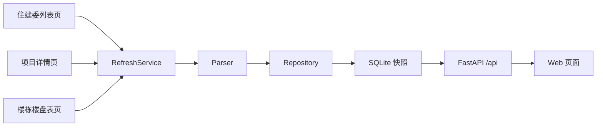

# 架构说明

## 目标

一期目标是把石景山区 17 条期房预售项目跑通：采集住建委页面、保存本地快照、计算本次与上次成功快照之间的状态变化，并用 Web 页面展示总览、小区、楼栋和房源楼盘表。

## 模块边界

- `app/main.py` 是 HTTP 层，只负责 API 路由、刷新任务状态和静态页面服务。通过 `create_app()` 支持测试注入临时数据库。
- `app/crawler.py` 是采集编排层，只负责调用 client 下载列表页、项目页、楼栋页，并要求全量成功后才写入成功快照。
- `app/parser.py` 是纯解析层，不访问网络、不访问数据库。输入 HTML，输出结构化 dataclass。
- `app/repository.py` 是持久化层，拥有 SQLite schema、快照写入、变化对比和页面所需 read model。
- `web/` 是前端层，优先使用 `/api/*` 数据；API 不可用时保留 demo 数据，便于快速查看 UI。

## 数据流

## 快照策略

每次刷新先创建 `running` 快照。只有列表页、项目页、楼栋页全部采集并解析成功，才写入 `house_states` 并把快照标记为 `success`。任意错误会标记为 `failed`，前端继续读取上一次成功快照。

这样可以避免“半更新”导致同一天数据看起来异常减少。

## 分组策略

一期不让用户手动创建项目组，按 `app/grouping.py` 中固定规则把石景山 17 条预售项目映射到项目组。后续如扩到全北京，可以把该规则升级为配置表或管理页面。

## 静态资源策略

FastAPI 只挂载 `web/` 到 `/static`，不暴露项目根目录、数据库、测试样本和源码。这一点已有 API 测试保护。
